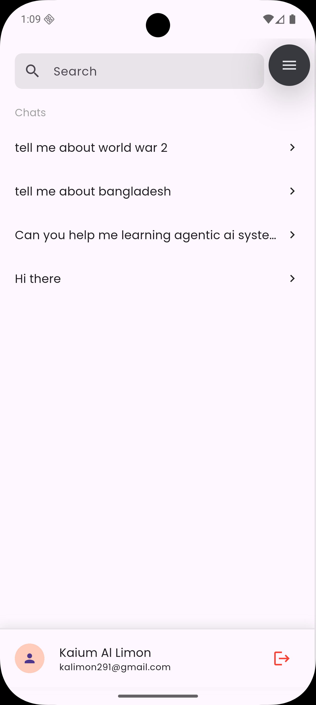

# Nex - AI Chatbot Application

[](https://opensource.org/licenses/MIT)

## Overview
Nex is a modern AI chatbot application built with Flutter, offering a ChatGPT-like experience. It provides an intuitive interface for AI-powered conversations, backed by Supabase for user management and Hive for local storage. The application implements a clean architecture pattern and uses Provider for state management.

## Screenshots

### Authentication Flow
<div align="center">
  
  
  
</div>

### Chat Interface
<div align="center">
  
  
</div>

The application features a smooth user experience from authentication to AI interactions:
- **Splash Screen**: Modern app initialization screen
- **Authentication**: Clean login and registration interfaces
- **Chat History**: List of all your AI conversation sessions
- **Messages**: Interactive AI chat interface with message history

## Features
- AI-powered conversational interface
- Context-aware chat responses
- Chat history persistence
- User authentication (Login/Register)
- Modern and clean UI with Google Fonts
- Environment variable support
- Dark/Light theme support [Coming soon]

## Tech Stack
- **Framework**: Flutter
- **State Management**: Provider
- **Backend**: Supabase
- **Local Storage**: Hive
- **Authentication**: Supabase Auth
- **UI Components**: Material Design
- **Fonts**: Google Fonts
- **Environment Variables**: flutter_dotenv

## Project Structure
```
lib/
├── app/
│   ├── data/        # Data layer (repositories, data sources)
│   ├── models/      # Data models and chat message structures
│   ├── providers/   # State management
│   ├── services/    # AI integration and business logic
│   └── views/       # UI components and pages
└── main.dart        # Application entry point
```

## Dependencies
- `flutter_dotenv`: ^5.2.1
- `provider`: ^6.1.1
- `supabase_flutter`: ^2.3.4
- `hive`: ^2.2.3
- `hive_flutter`: ^1.1.0
- `google_fonts`: ^6.2.1
- `flutter_markdown`: ^0.7.7+1
- `path_provider`: ^2.1.5
- `http`: ^1.2.0
- `groq`: ^1.0.0

## Getting Started

### Prerequisites
- Flutter SDK (^3.7.2)
- Dart SDK
- A Supabase account and project
- AI API credentials (e.g., OpenAI/Groq API key)

### Setup
1. Clone the repository
```bash
git clone https://github.com/kaiumallimon/nex.git
cd nex
```

2. Create a `.env` file in the root directory with your credentials:
```
SUPABASE_URL=your_supabase_url
SUPABASE_KEY=your_supabase_anon_key
GEMINI_API_KEY=your_ai_api_key
```

3. Install dependencies
```bash
flutter pub get
```

4. Run the application
```bash
flutter run
```

## Architecture
The application follows a clean architecture pattern with the following layers:
- **Views**: UI components and chat interface
- **Providers**: State management using Provider package
- **Services**: AI integration and chat processing
- **Models**: Chat message models and AI response structures
- **Data**: Message history and user data management

## State Management
The application uses Provider for state management with the following main providers:
- `SplashProvider`: Handles application initialization
- `LoginProvider`: Manages authentication state
- `RegisterProvider`: Handles user registration
- `ConversationProvider`: Manages AI chat conversations
- `ChatProvider`: Handles message processing and AI responses
- `WrapperProvider`: Manages overall application state

## Features in Detail
- **AI Chat Interface**: Clean and intuitive chat interface similar to ChatGPT
- **Message History**: Persistent storage of chat history using Hive
- **User Authentication**: Secure login and registration system
- **Real-time AI Responses**: Integration with AI APIs for natural language processing
- **Markdown Support**: Proper rendering of code blocks and formatted text in AI responses

## Contributing
Contributions are welcome! Please feel free to submit a Pull Request.

## License
This project is licensed under the MIT License - see the [LICENSE](LICENSE) file for details. The MIT License is a permissive license that allows you to do anything you want with the code as long as you provide attribution back to the author and don't hold them liable.

## Contact
For any queries or suggestions, please open an issue in the repository.
